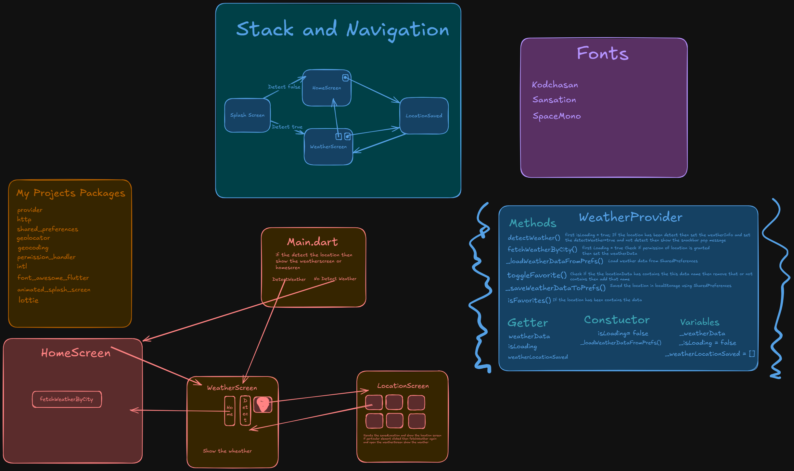

# LocalBreeze 🖌️


## Overview 📙


Welcome to **LocalBreeze**, your one-stop weather application designed to provide accurate, real-time weather updates at your fingertips. Built with Flutter, this app combines beautiful design with high-performance functionality to enhance your everyday weather-checking experience.

---

## Screenshots 📷

### Light Mode ☀
<!-- Add 3d Light Mode Mockup -->


---
### Dark Mode 🌙
<!-- Add 3d Dark Mode Mockup -->


---
## Design & Behind the Scenes 🎨

- **Figma Design**: [View Design](https://www.figma.com/design/m7HNn6J5kZBqyqN3s2lDIL/WeatherApp?node-id=0-1&p=f&t=lPeFK6B6DwohuB77-0)
- **Behind the Scenes**: 

---

## Dependencies 📦️

- [http](https://pub.dev/packages/http) - A composable, Future-based library for making HTTP requests.
- [provider](https://pub.dev/packages/provider) - A wrapper around 
InheritedWidget to make them easier to use and more reusable.
- [shared_preferences](https://pub.dev/packages/shared_preferences) - Persistent storage for simple data.
- [geolocator](https://pub.dev/packages/geolocator) - A Flutter geolocation plugin for Android and iOS.
- [geocoding](https://pub.dev/packages/geocoding) - A Flutter plugin for reverse geocoding and geocoding.
- [permission_handler](https://pub.dev/packages/permission_handler) - A Flutter plugin to check and request permissions.
- [intl](https://pub.dev/packages/intl) - Contains code to deal with date and number formatting and parsing.
- [font_awesome_flutter](https://pub.dev/packages/font_awesome_flutter) - The Font Awesome Icon pack available as Flutter Icons.
- [animated_splash_screen](https://pub.dev/packages/animated_splash_screen) - TA package to show an animated splash screen.
- [lottie](https://pub.dev/packages/lottie) - Render After Effects animations natively on Flutter.


## Features 🌟
- **Real-Time Weather Updates**: Get the most up-to-date weather information.
- **Location-Based Data**: Automatically fetch weather details for your location.
- **Search Cities**: Check the weather anywhere in the world.

## Aditional Features
- Discover the weather at your place.
- Discover the weather around the world.
- 24-hour weather forecast.
- Wind speed and direction.
- Provide details on humidity, pressure, UV, and chance of rain.
- Automatically theme managed by the time.
- Beautiful and friendly user interface.
- Pull to refresh to weather data

---
---

## Getting Started
1. Get your API key by creating an account at [WeatherAPI](https://www.weatherapi.com).
2. Clone the repository

   ```sh
   git clone https://github.com/naveddeveloper/LocalBreeze.git
   ```
3. Install all the packages by running
   ```sh
   flutter pub get
   ```
4. Navigate to **lib/providers/weather_provider.dart** and search APIKEY and paste your API key to the APIKEY variable
   ```dart
   static const String APIKEY = 'Your API Key';
   ```
5. Run the App
   ```dart
   flutter run
   ```
---

## Don't forget to :star: the repository.

## Support & Contact 📧

For any inquiries or support, feel free to contact me:

- **Email**: ansarinavedhabeeb@gmail.com
- **Instagram**: [naveddeveloper](https://www.instagram.com/naveddeveloper)

---
## Feedback 💬

If you have any suggestions, feel free to open an issue or contact me on [Instagram](https://www.instagram.com/naveddeveloper).

---

## Download the APK
[](https://github.com/naveddeveloper/LocalBreeze/blob/main/localbreeze.apk)


Thank you for using **LocalBreeze**! Stay tuned for more updates and features. 😊
